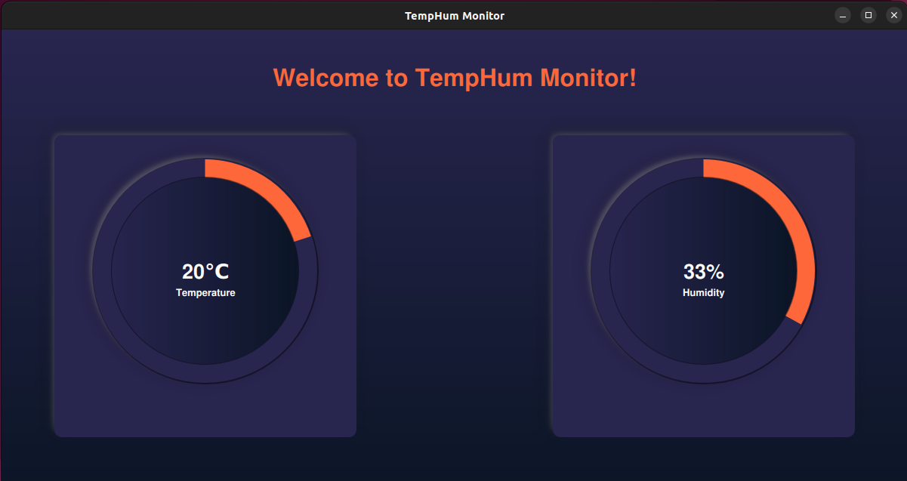

# Raspberry Pi Temperature Monitoring with QML

Raspberry Pi Temperature Monitoring with QML is a comprehensive project that allows you to monitor and display humidity and temperature data from a DHT11 sensor connected to your Raspberry Pi. The project consists of three main components: a C++ application running on the Raspberry Pi to read sensor data, blink a led ofter data reading and update a CSV file, a Bash script to send the CSV file to your PC at regular intervals, and a QML-based GUI on your PC to visualize and interact with the sensor data.



## Features

- **Sensor Data Acquisition:** Utilizes a DHT11 sensor connected to the Raspberry Pi to read humidity and temperature values.
- **Data Logging:** Saves the sensor data to a CSV file for logging and analysis.
- **Remote Data Retrieval:** Transfers the CSV file from the Raspberry Pi to your PC using a Bash script, allowing for remote data access.
- **User-Friendly Interface:** Displays the sensor data in a visually appealing and interactive QML-based GUI on your PC.

## Components

### C++ Application (Raspberry Pi)

- **Sensor Interface:**  Utilizes an LED and DHT11 sensor connected to the Raspberry Pi. Custom configurations for these components have been specified in the `device tree binary` to ensure proper interfacing and functionality.
- **Data Logging:** Implements functions to insert sensor data into a CSV file for logging and analysis.
- **LED Feedback:** Provides visual feedback by blinking an LED once the CSV file update is completed. The LED is configured to blink in a `separate thread` to not affect the main functionality of the program.
- **Scheduled Data Acquisition:** Utilizes a timer or loop with a 5-second delay to read sensor values at regular intervals.

### Bash Script (Raspberry Pi)

- **File Transfer:** Copies the CSV file from the Raspberry Pi to your PC using scp or a similar method.
- **Scheduled Execution:** Uses a cron job to schedule the execution of the script at regular intervals, such as every 60 minutes.

### QML GUI (PC)

- **Data Visualization:** Designs a QML-based GUI to display the sensor data from the CSV file on your PC.
- **Real-Time Updates:** Updates the GUI dynamically as new sensor data is received.

## Setup

1. **Hardware Setup:** Connect the DHT11 sensor and LED to the GPIO pins of your Raspberry Pi.
2. **Configuration:** 
   - Modify the led and sensor files paths to match your setup in `monitoring_system.hpp`
   - Modify the C++ application and Bash script as needed to match your setup and preferences.
   - Modify the bash script with you Raspberry Pi name.
  
3. **Project Setup:** 
   - Clone the project repository to your PC.
    ```bash
    git clone https://github.com/Abdelrahmanosama372/RaspberryPi-Temperature-Monitoring-with-QML.git
    ```
   - in the src directory run `cmake` to compile the project code.
   - copy the executable `monitorsys` from the `build` directory to the Raspberry Pi and run it

## Usage

1. **Start C++ Application:** Run the C++ application on your Raspberry Pi to read sensor data and update the CSV file.
2. **Run Bash Script:** Execute the Bash script on your PC to get the CSV file from the Raspberry Pi at regular intervals.
3. **Launch QML GUI:** Open the QML-based GUI on your PC to visualize and interact with the sensor data in real-time.

## Contributing

Contributions are welcome! If you have any ideas for improvement, new features, or bug fixes, feel free to open an issue or submit a pull request.

